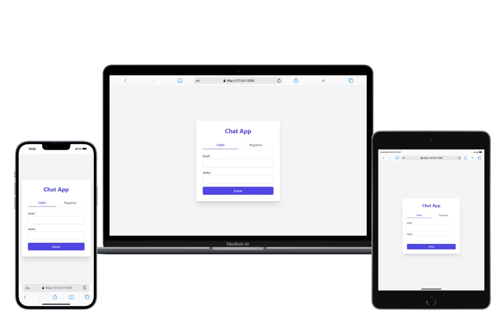
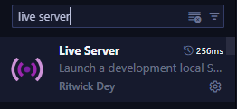
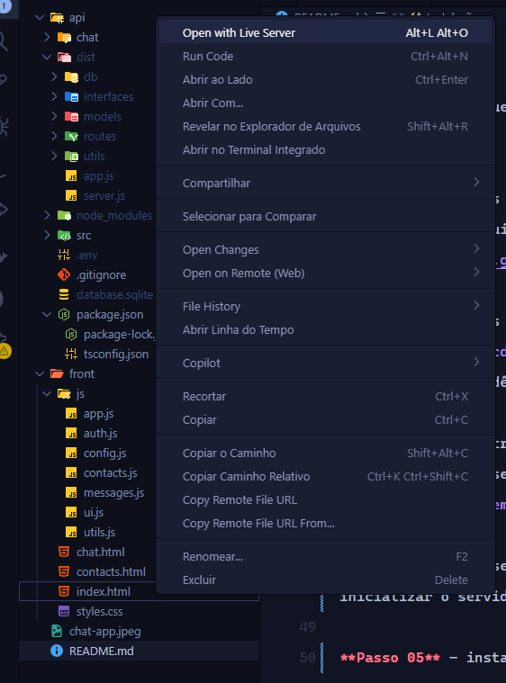
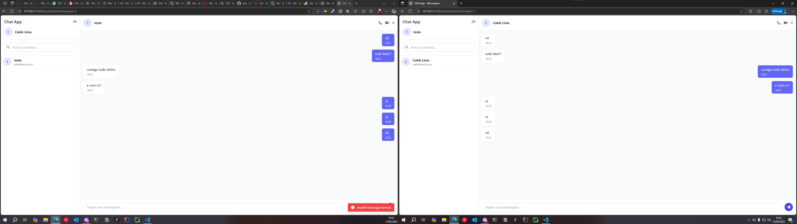

## ✅ Chat App

Projeto de comunicação em Sistemas Distribuidos!
Aplicação Front End e Back End de comunicação de entre processos via Sockets utiliando API REST!
Realização de simulação de um cenario real de troca de informações entre cliente e servidor!

## Requisitos do Sistemas

API REST utilizando a linguagem de programação **TypeScript**!  
Arquitetura do Sistema: **Cliente-Servidor**!  

## Funções

Envio e recebimento de mensagens!  
Requisição de serviços!  

## ⚙️ Tecnologias utilizadas

**Node.js**: Ambiente de execução JavaScript no lado do servidor, ideal para construir aplicações escaláveis e performáticas.  

**SQLite3**: Banco de dados relacional leve, ideal para aplicações pequenas a médias, com armazenamento local em arquivos.  

**JavaScript**: Linguagem de programação utilizada para desenvolver funcionalidades dinâmicas no lado cliente e servidor.  

**TypeScript**: Superset do JavaScript que adiciona tipagem estática, facilitando o desenvolvimento mais seguro e organizado.  

**Tailwind CSS**: Framework utilitário de CSS que permite construir interfaces modernas e responsivas com agilidade.  

**Sequelize**: ORM (Object Relational Mapping) para Node.js que facilita a interação com bancos de dados relacionais como o SQLite.  

**JWT (JSON Web Token)**: Tecnologia usada para autenticação segura entre cliente e servidor, baseada em tokens.  

**HTML**: Linguagem de marcação essencial para a estruturação de conteúdo na web.  

## 🛠️ Instalação

Certifique-se de que o **Node.js** esteja instalado na sua máquina.  

**Passo 01** – Após realizar o download, abra o terminal da sua IDE e digite o seguinte comando:  `git clone https://github.com/jovemcleb/chat-app.git`

**Passo 02** – Após realizar a clonagem na sua máquina local, entre na pasta:  `cd api`  
e instale as dependências com:  `npm i`

**Passo 03** – Dentro da pasta `api`, crie um arquivo chamado `.env` e adicione o seguinte conteúdo:  `JWT_SECRET="oSistemaEhFalho"`

**Passo 04** – Em seguida, rode o seguinte comando para inicializar o servidor:  `npm run dev`

**Passo 05** – instale a Extensão **Live Server** no vs code

**Passo 06** –Por fim, vá até a pasta `front` e clique com o botão direito em cima do arquivo `index.html`, depois Open with Live Server.  

Ele irá inicializar nesta url:  
`http://127.0.0.1:5500/front/index.html`

### Agora é só testar o projeto

---

## 👨‍💻 Autores

**Nome:** Elivanilson Jr  
**Nome:** Caleb Lima  
**Nome:** José Pires  
**Nome:** Camila Vidal  
**Nome:** Erick Sabio  
**Nome:** Everson Diogo

## 📜 Licença**

Este projeto está sob uma licença aberta. Isso significa que você pode usar, modificar, copiar e distribuir o código como quiser, sem precisar pedir permissão ou dar créditos ao autor.
Use em projetos pessoais, escolares, comerciais ou qualquer outro propósito. O objetivo é compartilhar conhecimento e facilitar a vida de todos!
